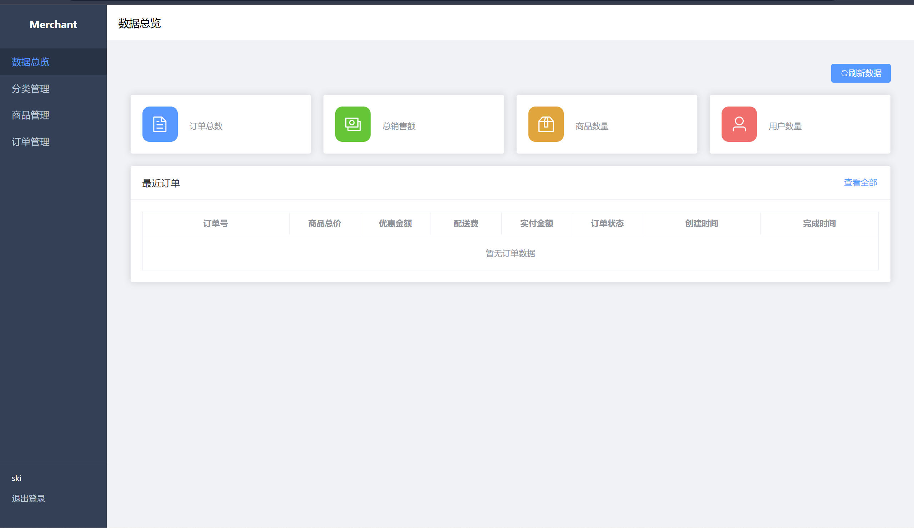

# Caneat Saas

> 外卖商家商品管理系统后台

## start run

```Text
npm run <script>

    "dev": "vite",
    "build": "vue-tsc -b && vite build",
    "preview": "vite preview",
    "docs:dev": "vitepress dev docs",
    "docs:build": "vitepress build docs",
    "docs:preview": "vitepress preview docs"
```

- 前三个是基于 vite 开发的 后台管理系统的 开发 构建 预览 运行命令
- 后三个是基于 vitepress 编写的文档使用的 开发 构建 预览 运行命令

## 技术栈

> 通过 vitepress 实现 的该项目的提供给商家的后台使用的文档管理

- Vue 3 + TypeScript + Vite

## 页面展示


